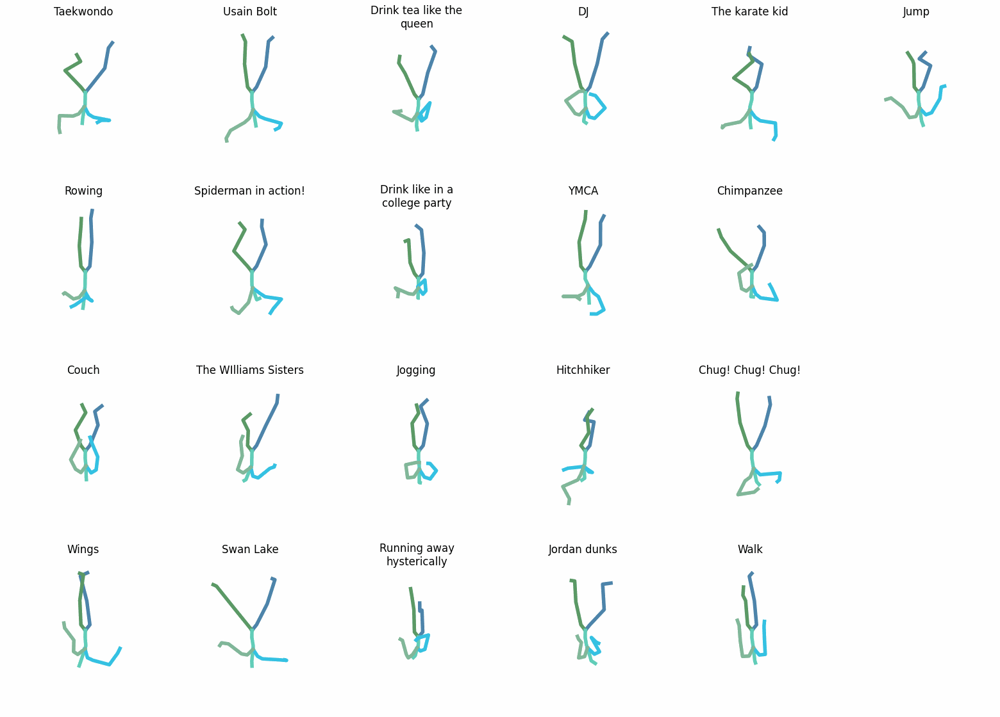
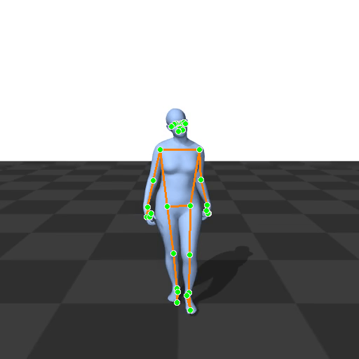

# Repository Navigation Guide

This repository contains the code for the following project:

> This report presents a systematic evaluation of computational models for the 60-class action recognition task on the BABEL dataset. I explore a hierarchy of methods, from classic machine learning models to custom-trained deep sequence models and large-scale pretrained architectures (2S-AGCN, MotionCLIP). My results demonstrate a clear performance progression: the KNN baseline achieved **34.4%** accuracy, a custom LSTM improved to **38.0%**, and the pretrained MotionCLIP model obtained the highest accuracy of **45.47%**. This work concludes that while custom models can capture meaningful dynamics, the complexity and class imbalance of BABEL are best addressed by leveraging the powerful representations of large pretrained models.

---

## Table of Results

| Model Category | Model Name             | Top-1 Accuracy | Top-5 Accuracy |
| -------------- | ---------------------- | -------------- | -------------- |
| Baseline       | SVM                    | 29.3%          | -              |
| Baseline       | KNN                    | 34.4%          | -              |
| Custom         | Bi-directional LSTM    | 38.0%          | 68.7%          |
| Pretrained     | 2S-AGCN                | 34.04%         | 68.65%         |
| Pretrained     | MotionCLIP             | 45.47%         | 64.48%         |

---

## Project Structure Overview

This guide will help you navigate the repository structure. Below are important sections and details:

### 1. Code and Experiment Scripts
- **Model Implementations:** Contains implementations for the various models used in the study (e.g., SVM, KNN, Bi-directional LSTM).
- **Pretrained Architectures:** 
  - **2S-AGCN:** Customized modifications required to run the original code can be found here. The original 2S-AGCN code is available at the [BABEL repository](https://github.com/hehesam/BABEL/tree/main).
  - **MotionCLIP:** This section contains the integration and evaluation of the MotionCLIP model. The original implementation of MotionCLIP is maintained by [GuyTevet](https://github.com/GuyTevet/MotionCLIP).  
    - **Pre-trained Models:** All pre-trained models for MotionCLIP are available in the MotionCLIP repository. Please refer to the releases and README in that repository to access the following models:
      - [MotionCLIP Pretrained Model 1](https://github.com/GuyTevet/MotionCLIP/releases/tag/model1)
      - [MotionCLIP Pretrained Model 2](https://github.com/GuyTevet/MotionCLIP/releases/tag/model2)
      - [MotionCLIP Pretrained Model 3](https://github.com/GuyTevet/MotionCLIP/releases/tag/model3)
      
### 2. Demo Model Analysis
- **Successful MotionCLIP Execution:**
  - A key visual indicator of the successful execution of the MotionCLIP model is the animated GIF located at:
  
    `Results/clip_text_paper_texts_fig_100.gif`
    
  - You can view the demo directly in this README with the image below:

  

- **Failed Mapping from MediaPipe to NTU Format:**
  - Another animated GIF, located at `Results/output.gif`, demonstrates an experimental attempt at real-time pose estimation. In this demo, the model tried to map MediaPipe-detected joints into the NTU format before classifying the actions.
  - **Explanation:** The results shown in this GIF indicate that the mapping from MediaPipe joints to the NTU format was not successful. This failure highlights the challenges in aligning different pose estimation outputs with the required input format for the classification models. The experiment serves as a valuable learning point for further refinement of the preprocessing and mapping pipeline.

  

---

## Additional Resources
- **Documentation:** This README serves as a navigation guide. Refer to in-code comments and documentation within each module for further details.
- **Folder Structure:**
  - **/src/**: Contains source code for the defined models and utility functions.
  - **/experiments/**: Scripts for running experiments and evaluations.
  - **/Results/**: Contains output results including visual indicators such as the MotionCLIP demo GIF and the failed mapping GIF.
  - **/configs/**: Configuration files for training and model integration.
- **Testing & Evaluation:** Explore the `/tests/` directory for testing scripts, and use experiment scripts in `/experiments/` to replicate reported results.

---

## References
1. Dataset and Evaluation Methodology: [BABEL Dataset](#)
2. Custom Training Details: Sections of the codebase dedicated to deep sequence models.
3. Pretrained MotionCLIP Details: [MotionCLIP Repository](https://github.com/GuyTevet/MotionCLIP)

---

This guide is intended to assist in navigating through the various components and understanding how they come together in this project. Enjoy exploring the repository!